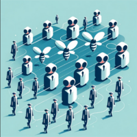

# AgentFlow
> *It's the Nuxt of agentic* (a deepfake of Bill Gates)

## What is AgentFlow?

**AgentFlow** is a micro-framework designed to hide complexity and expose low code formalism to define simply and in a low code way, arbitrarely complexe agentic pipelines.

## Why use AgentFlow?

AgentFlow allows you to define any agentic behavior with only the necessary code. It externalizes avoidable complexity, letting you focus on what matters.


## Agentic paradigms

We can distinguish several approaches  to agentic.

The ones I tried (hence this is not an exhaustive list in any way)

________


### **Monolithic agents**


An agent with tools and RAG. A single conversation with dynamic context handling.
OpenAI ChatGPT's interface qualifies as a monolithic agent
```
You are a helpful assistant.
# Context
{context}
# Tools
{tools}
```
**Pros**: 
* Can be implemented with langchain
* Simpler overall
  
**Cons**:
* A single agents is quickly overwhelmed with too many tools
* No elaborate control flows


__________


###  __**Swarm of clones**__


A group of initially identical agents, with own history/context (and various levels of shared context), and a communication protocol.

* **Pros**:
* Interesting emerging behaviors
* **Cons**:
* Incredibly complexe to implement (at least in my experience)
* Poor performances for complexe/multi-step tasks
  

____________


### **Swarm of specialists**

 

Same as above but with several types of agents


_______

## NOTE about swarms
The "swarm" approach can yield impressive results on some specific tasks.
One major pro of the *Tree of specialists* paradigm is that a leaf agent can be a swarm (or any kind of agent) . Moreover, any existing agent can easily be plugged in a ToS cognitive architecture.

__________

### **Tree of specialists**


Agents as rigid parts of a Python algorithm

Which is what **AgentFlow** is about.

**Key principles**: 
* Control flow is code's responsibility
* Agents are functions
* The burden of tool use should be taken care of by algorithm whenever it's possible. 
* Low level agents should have as little responsibility as possible (idealy, 1~2 tools per agent, no more than 4).


__________


## Agents as functions (black box/outside view)
Let's define the term **Agent**.

**Black box description** (as opposed to *implementation details*):
From the outside, an agent is conceptually a function. It ingests inputs and return outputs of given types.
While this principle is simple and doesn't look like much, it proved unsuspectedly powerful to implement complex control flow over LLM inferences.

**Exemple of control flow with agentFlow**
```python
for task in Agent['Task_lister'](user_input):
    Agent['Task_executor'](task)
```

It allows for strong algorithmic decoupling, which in turn makes easy to have very specialist agents.


Akin to a function, an agent can itself be an arbitrarly complexe set of agents. Resulting for a given task in many contexts/conversations.

**Note**: One thing I first thought as a tradeoff: my approach is heavy in LLM calls. In reality, it's balanced by the fact it requires overall less tokens generated than other approachs (when done correctly). Also, some Agents can run with `gpt-3.5-turbo`.


