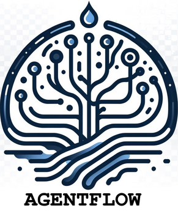
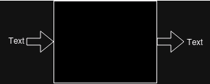
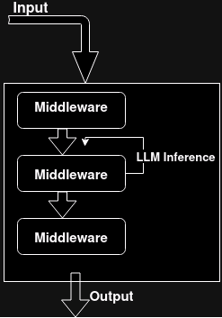

# AgentFlow
> *It's the Nuxt of agentic* (a deepfake of Bill Gates)

## What is AgentFlow?

**AgentFlow** is a framework designed to facilitate the creation of agents for various tasks. Conceptually, an agent in AgentFlow is a function that takes inputs and produces outputs. It doesn't necessarily have to interact with a user. The framework is designed to be low code, reducing the amount of boilerplate code needed to create complex agents.

## Why use AgentFlow?

AgentFlow allows you to define any agentic behavior with only the necessary code. It externalizes avoidable complexity, letting you focus on what matters. This is achieved through the use of tools and middlewares.

- **Tools**: These are functions that perform specific tasks. For example, a tool could be a function that parses text, executes a shell command, or interacts with a database. Here's an example of a tool that executes a shell command:

```python
from agentflow import tool
import subprocess

@tool
def shell(command: str) -> str:
    result = subprocess.run(command, shell=True, stdout=subprocess.PIPE, stderr=subprocess.PIPE, text=True)
    if result.returncode != 0:
        return f"Error: {result.stderr}"
    return result.stdout
```

- **Middlewares (mw)**: These are functions that process the input and output of an agent. They can modify the input, the output, or both. Here's an example of a middleware that loops over a conversation:

```python
from agentflow import mw,Tool, Agent 

@mw
def lucy_loop(ctx, conv):
    last_msg = conv[-1]
    agentName, content = last_msg.content.split(':',1)
    
    if agentName == 'user':
        return content
    else:
        try:
            return conv.rehop(f"{agentName}:{Agent[agentName](content)}")
        except:
            return conv.rehop(f"{agentName} is sick today, please inform user he won't come to work")
```

- **Rehop**: This is a method of the Conversation class that creates a new conversation with an added message. It's used to continue the conversation with a new message from the agent. Here's how you can use it:

```python
new_conv = conv.rehop('New message from the agent')
```
# Good AI technical test
## TL;DR
### install
```shell
git clone 
pip install -e .

# If you like verbosity
export AGENTFLOW_DEBUG=1```
## Foreword 2: My approach to prompting

I only ever use in context learning/few shots prompting.


### Methodology: show don't tell

I first start with a system prompt explaining the agent what it does, its tools, and how it should reason/use tools.

Then I proceed to try test cases.
Whenever the agent behave not as expected, I add an interaction to the prompt, as if the agent had replied in the exact expected way.

At some point the agent will often generalize.

In many tasks, I got `gpt-3.5-turbo` with few shots to vastly outperform `gpt-4-0314` with 0 shots.

### Side note: beyond GPT

Few shot learning with long context 7b models can yield results good enough to create synthetic dataset. I played with this idea a little bit and I can say for sure fine tuning a viable option for leaf agents in a tree of specialist architecture (I'll define all those words later on) which comes with huge performances gains.

## Foreword 3: Why "Lucy" ?
By convention, I name leaf agents with meaningful names (describing what the agent does) and high level, end agents (those users interact with) with actual human name.

## AgentFlow
(Logo generated by Dall-e with a "transparent background")



#### Why low code 

The first motivation is that I find **Low Code** to be an intrinsically valid approach; it allows for fast prototyping and greatly reduces avoidable complexity.

The second motivation is: Low code seems like the obvious approach for self improving agents.

### Base assumptions

 we'll consider LLMs as black boxes that take text as input and return text.



A future implementation of **AgentFlow** should obviously use embeddings, semantic routing and vector databases


### Agentic paradigms

We can distinguish several approaches  to agentic.

The ones I tried (hence this is not an exhaustive list in any way)

#### **Monolithic agents**


An agent with tools and RAG. A single conversation with dynamic context handling.
OpenAI ChatGPT's interface qualifies as a monolithic agent
```
You are a helpful assistant.
# Context
{context}
# Tools
{tools}
```
**Pros**: 
* Can be implemented with langchain
* Simpler overall
  
**Cons**:
* A single agents is quickly overwhelmed with too many tools
* No elaborate control flows


####  __**Swarm of clones**__


A group of initially identical agents, with own history/context (and various levels of shared context), and a communication protocol.

* **Pros**:
* Interesting emerging behaviors
* **Cons**:
* Incredibly complexe to implement (at least in my experience)
* Poor performances for complexe/multi-step tasks
  

### **Swarm of specialists**

 

Same as above but with several types of agents


## NOTE about swarms
The "swarm" approach can yield impressive results on some specific tasks.
One major pro of the *Tree of specialists* paradigm is that a leaf agent can be a swarm (or any kind of agent) . Moreover, any existing agent can easily be plugged in a ToS cognitive architecture.

## **Tree of specialists**


Agents as rigid parts of a Python algorithm

Which is what **AgentFlow** is about.

**Key principles**: 
* Control flow is code's responsibility
* Agents are functions
* The burden of tool use should be taken care of by algorithm whenever it's possible. 
* Low level agents should have as little responsibility as possible (idealy, 1~2 tools per agent, no more than 4).


## Agents as functions (black box/outside view)
Let's define the term **Agent**.

**Black box description** (as opposed to *implementation details*):
From the outside, an agent is conceptually a function. It ingests inputs and return outputs of given types.
While this principle is simple and doesn't look like much, it proved unsuspectedly powerful to implement complex control flow over LLM inferences.

**Exemple of control flow with agentFlow**
```python
for task in Agent['taskLister'](user_input):
    Agent['taskExecutor'](task)
```

It allows for strong algorithmic decoupling, which in turn makes easy to have very specialist agents.

```python
for fact in Agent['LTM_fact_extract'](user_input):
    Agent['LTM_fact_store'](fact)

context = Agent['LTM_fact_recall'](user_input)
```

Akin to a function, an agent can itself be an arbitrarly complexe set of agents. Resulting for a given task in many contexts/conversations.

**Note**: One thing I first thought as a tradeoff: my approach is heavy in LLM calls. In reality, it's balanced by the fact it requires overall less tokens generated than other approachs (when done correctly). Also, some Agents can run with `gpt-3.5-turbo`.


**experimental takeaway of this approach**
* Increase overall performance
* Multi-LLM architecture (some tasks can be handled by _gpt-3.5-turbo_, ) with gains in both speed and cost.


## Agents as stacks of Middlewares (inside view/implementation details)
**Inside**:
From the inside an agent is a stack of ordered middlewares.
Each middleware should only contain agent core logic.
(Printing, streaming, logging... should not ever be middlewares concern)

An agent is instanciated by a string representing the middlewares that composes it

### Primitive types
`Conversation` is an entity composed of value objects `Message`s.
`MW`, `Tool` and `Agent` are containers (`__getitem__(self, key:str)`), holding respectively: middlewares, tools and agents.
`mw` and `tool` are decorators


A conversation contains flags.
if a middleware returns a conversation with `should_infer` flag to `True`, the conversation is fed to a LLM (specified with a flag, `gpt-4` default) then fed back to the same middleware.
In all other cases, the output of a middleware is fed to the next, and the output of the last middleware is the output of the agent.

____

Giving this execution flow:




## Magic import
To be defined and usable, an Agent, middleware or tool only has to exist under the directories `agents/`, `middlewares` or `tools/`.
Which allows for fast prototyping and makes self-improvement easier.

Imagine that file structure
```
.
├── app.py
├── tools
│   └── my_tool.py
├── middlewares
└── agents
```

(note the absence of `__init__.py`)


`my_tool.py`
```python
from agentflow import tool

@tool
def my_tool():
    print('hello world')

```

To use the tool, all you have to do is
`app.py`
```python
from agentflow import Tool

Tool['my_tool']()
```


## __Creating an agent walkthrough__


I initially wrote a long technical explainer on how to implement an agent, a tool and a middleware.
It turns out, a walkthrough of how to create a real world agents makes a much better job at this. 


Let's implement `ShellGPT`, an agent that interacts with the Linux shell in a feedback loop (with as many hops as needed to complete a task)

_____

### **__Step 1: Agent definition__**
```python
from agentflow import Agent

Agent(name='ShellGPT', middleware='llm|shellGPT_loop')
```
__**Note**__: `llm` is an AgentFlow builtin middleware. It triggers a LLM inference before the next middleware

______


### **__Step 2: middleware implementation__**
`middlewares/shellGPT_loop.py` 
```python
from agentflow import mw, Tool

@mw 
def shellGPT_loop(ctx, conv):
    parser = Tool['parser']('```sh','```')
    
    if commands:= parser(conv[-1].content):
        return conv.rehop(
            Tool['shell'](commands[0])
        )
```

**Note**: `ctx` is a dict that {"agent":[Calling Agent], "user_input":[user input]}.

__________

### **__Step 3: tool implementation__**

```python
from agentflow import tool
import subprocess

@tool
def shell(command: str) -> str:
    result = subprocess.run(command, shell=True, stdout=subprocess.PIPE, stderr=subprocess.PIPE, text=True)
    if result.returncode != 0:
        return f"Error: {result.stderr}"
    return result.stdout
```

_____

### **__Step 4: prompting__**

Until now, every bit of code we've written can be in a file with an arbitrary name or arbo (as long as it's under the right directories).

The prompt must be in the file:`prompts/{agent_name}.conv`.
By convention (and because few shots generally outperforms zero-shot) what we'll call `prompt` will always be a `Conversation`

`prompts/ShellGPT`
```
system:You are a shell assistant.
syntax: ``​`sh
{command}``​`
ONLY ONE COMMAND PER MESSAGE

__-__

user:can you create a directory /tmp/popo .

__-__


assistant:I should use mkdir
``​`sh
mkdir /tmp/popo
``​`

__-__

assistant:It's done :)

__-__


user:{user_input}
```

As explained earlier, my approach to prompting is "show don't tell". Because each agent has a simple to define task to accomplish, I construct few shots conversation until the LLM behaves as expected.

Explaining to an agent how it works is useful, but few-shot prompting is powerful enough that you could sometimes even skip the explanation and still see your agent behave as expected.

____


### **__Step 5: Use agent__**

`app.py`
```python
from agentflow import Agent

Agent['ShellGPT']('can you resize by 50% all images under /tmp/foo ?')

```

__________

That's it.
ShellGPT will rehop as many times as the LLM returns a command.
